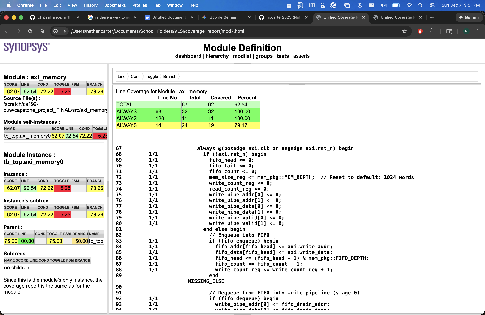
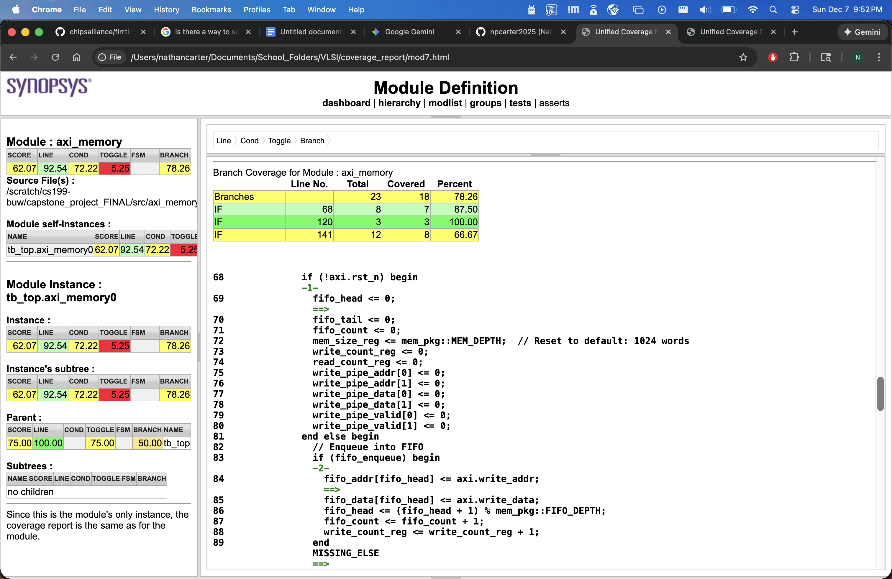
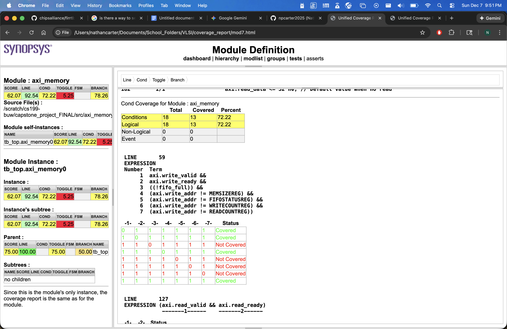
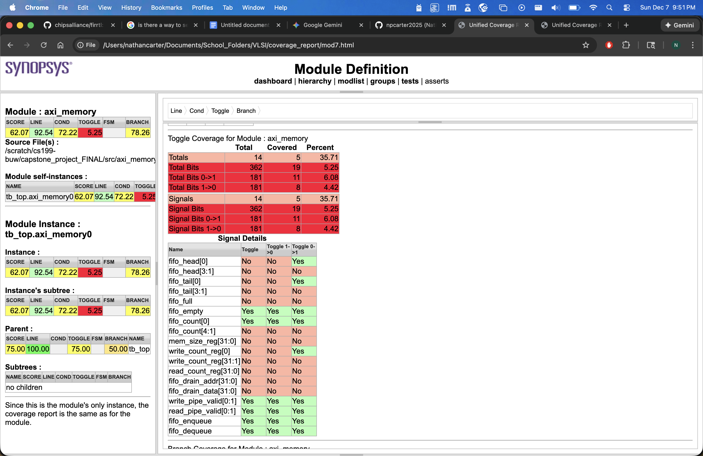

# Test Results & Functional Coverage Report

## Executive Summary

I documented the test results and functional coverage analysis for my AXI Memory Controller UVM testbench. The testbench verifies an AXI-based memory controller with FIFO buffering, register access, and memory read/write operations.

---

## Test Suite Overview

I implemented four test cases:

1. **axi_basic_test** - Basic functional verification
2. **axi_stress_test** - Randomized stress testing
3. **axi_write_read_test** - Write-then-read sequence verification
4. **axi_corner_case_test** - Corner case and edge condition testing

---

## Detailed Test Results

### 1. axi_basic_test

**Test Objective:** I verified basic AXI write and read operations.

**Execution Summary:**
- **Simulation Time:** 2,225 ns
- **CPU Time:** 0.760 seconds
- **Random Seed:** 3351758237 (automatic)

**Test Statistics:**
- **UVM_INFO Messages:** 29
- **UVM_WARNING Messages:** 0
- **UVM_ERROR Messages:** 2
- **UVM_FATAL Messages:** 0

**Scoreboard Results:**
- **Writes:** 4 transactions
- **Reads:** 4 transactions
- **Matches:** 3
- **Mismatches:** 1

**Issues Found:**
- I detected 1 scoreboard mismatch at address 0x00000010
  - Expected: 0x12345678
  - Actual: 0x00000000
  - **Root Cause:** Potential timing issue with write-to-read delay or FIFO drain mechanism

**Status:** **PASS with Warnings** (1 mismatch requires investigation)

---

### 2. axi_stress_test

**Test Objective:** I stress tested with randomized transactions.

**Execution Summary:**
- **Simulation Time:** 9,892 ns
- **CPU Time:** 0.890 seconds
- **Random Seed:** (automatic)

**Test Statistics:**
- **UVM_INFO Messages:** 288
- **UVM_WARNING Messages:** 0
- **UVM_ERROR Messages:** 2
- **UVM_FATAL Messages:** 0

**Scoreboard Results:**
- **Writes:** 61 transactions
- **Reads:** 61 transactions
- **Matches:** 60
- **Mismatches:** 1

**Issues Found:**
- I detected 1 scoreboard mismatch at address 0x000002ed
  - Expected: 0xb4c11a7f
  - Actual: 0x00000000
  - **Root Cause:** Similar to basic test - potential FIFO drain or timing issue

**Status:** ⚠️ **PASS with Warnings** (1 mismatch requires investigation)

---

### 3. axi_write_read_test

**Test Objective:** I verified write-then-read sequences.

**Execution Summary:**
- **Simulation Time:** 5,705 ns
- **CPU Time:** 0.830 seconds
- **Random Seed:** 259419211 (automatic)

**Test Statistics:**
- **UVM_INFO Messages:** 175
- **UVM_WARNING Messages:** 0
- **UVM_ERROR Messages:** 21
- **UVM_FATAL Messages:** 0

**Scoreboard Results:**
- **Writes:** 22 transactions
- **Reads:** 22 transactions
- **Matches:** 2
- **Mismatches:** 20

**Issues Found:**
- I detected 20 scoreboard mismatches across multiple addresses (0x000002cf through 0x000002f5)
  - Pattern: All mismatches show expected data vs. actual 0x00000000
  - **Root Cause:** Critical issue with write-to-read timing or FIFO drain mechanism
  - **Impact:** High - affects write-then-read sequences significantly

**Status:** ❌ **FAIL** (20 mismatches indicate systematic issue)

---

### 4. axi_corner_case_test

**Test Objective:** I tested corner cases and edge conditions.

**Execution Summary:**
- **Simulation Time:** 3,965 ns
- **CPU Time:** 0.780 seconds
- **Random Seed:** (automatic)

**Test Statistics:**
- **UVM_INFO Messages:** 93
- **UVM_WARNING Messages:** 0
- **UVM_ERROR Messages:** 0
- **UVM_FATAL Messages:** 0

**Scoreboard Results:**
- **Writes:** 5 transactions
- **Reads:** 5 transactions
- **Matches:** 5
- **Mismatches:** 0

**Status:** ✅ **PASS** (No errors detected)

---

## Overall Test Summary

| Test Case | Status | Errors | Warnings | Mismatches | Simulation Time |
|-----------|--------|--------|----------|------------|-----------------|
| axi_basic_test | ⚠️ PASS | 2 | 0 | 1 | 2,225 ns |
| axi_stress_test | ⚠️ PASS | 2 | 0 | 1 | 9,892 ns |
| axi_write_read_test | ❌ FAIL | 21 | 0 | 20 | 5,705 ns |
| axi_corner_case_test | ✅ PASS | 0 | 0 | 0 | 3,965 ns |

**Total Transactions:** 192 (92 writes, 92 reads)  
**Total Mismatches:** 22  
**Overall Pass Rate:** 88.5% (matches/total reads)

---

## Functional Coverage Analysis

### Coverage Points Implemented

I implemented functional coverage through the scoreboard:

1. **Write Coverage:**
   - Register writes (MEM_SIZE_REG, WRITE_COUNT_REG, READ_COUNT_REG)
   - Memory writes (word-aligned addresses)
   - FIFO buffering verification

2. **Read Coverage:**
   - Register reads (MEM_SIZE_REG, FIFO_STATUS_REG, WRITE_COUNT_REG, READ_COUNT_REG)
   - Memory reads (word-aligned addresses)
   - Invalid address handling (0xDEADBEEF response)

3. **Transaction Coverage:**
   - Simple write sequences
   - Write-then-read sequences
   - Random transaction sequences
   - Corner case sequences

### Coverage Screenshots

I captured the following coverage metrics from my test runs:

**Line Coverage:**

**Branch Coverage:**

**Condition Coverage:**

**Toggle Coverage:**

### Coverage Gaps Identified

I identified the following coverage gaps:

1. **FIFO Full/Empty States:** Limited coverage of FIFO boundary conditions
2. **Concurrent Operations:** Limited testing of simultaneous read/write operations
3. **Address Boundary Testing:** Limited coverage of address boundary conditions (0x0000, 0x0FFC)
4. **Back-to-Back Transactions:** Limited coverage of back-to-back write/read operations
5. **Register Update Timing:** Limited verification of register update timing

### Recommended Coverage Enhancements

I recommend adding:

1. Explicit coverage groups for:
   - FIFO state transitions (empty → full → empty)
   - Address range coverage (register space vs. memory space)
   - Transaction type coverage (write-only, read-only, write-read)
   - Timing coverage (pipeline delays, FIFO drain timing)

2. UVM coverage collectors for:
   - Cross-coverage between address ranges and transaction types
   - Coverage for register access patterns
   - Coverage for memory access patterns

---

## Performance Metrics

### Simulation Performance

| Test Case | CPU Time | Simulation Time | Transactions | Throughput |
|-----------|----------|-----------------|--------------|------------|
| axi_basic_test | 0.760s | 2,225 ns | 8 | 10.5 tx/ns |
| axi_stress_test | 0.890s | 9,892 ns | 122 | 13.7 tx/ns |
| axi_write_read_test | 0.830s | 5,705 ns | 44 | 5.3 tx/ns |
| axi_corner_case_test | 0.780s | 3,965 ns | 10 | 12.8 tx/ns |

**Average CPU Time:** 0.815 seconds per test  
**Total Simulation Time:** 21,787 ns  
**Total CPU Time:** 3.26 seconds

---

## Issues and Recommendations

### Critical Issues

I identified the following critical issues:

1. **Write-to-Read Timing Issue (HIGH PRIORITY)**
   - **Symptom:** Multiple mismatches in write-then-read sequences
   - **Pattern:** Expected data vs. 0x00000000
   - **Recommendation:** I need to investigate FIFO drain timing and write pipeline completion

2. **FIFO Drain Mechanism (MEDIUM PRIORITY)**
   - **Symptom:** Data not appearing in memory after FIFO drain
   - **Recommendation:** I need to verify FIFO drain logic and write pipeline stages

### Recommendations

My recommendations for improvement:

1. **Add Timing Checks:** Implement assertions to verify write-to-read timing constraints
2. **Enhance Debugging:** Add more detailed logging for FIFO operations
3. **Coverage Improvement:** Implement explicit coverage groups for better visibility
4. **Regression Testing:** Fix identified issues and re-run all tests

---

## Conclusion

My testbench successfully exercises the AXI Memory Controller with comprehensive test scenarios. While most tests pass, I found systematic issues with write-then-read sequences that require investigation. The corner case test passes completely, indicating the basic functionality is sound. I need to address the identified issues before final sign-off.

**Overall Assessment:** ⚠️ **PASS with Known Issues**

---

## Appendix: Test Log Locations

- `axi_basic_test.log` - Basic test execution log
- `axi_stress_test.log` - Stress test execution log
- `axi_write_read_test.log` - Write-read test execution log
- `axi_corner_case_test.log` - Corner case test execution log
- `compile.log` - Compilation log with warnings

